<a name="top"></a>
<p align="center">
  <a href="#top">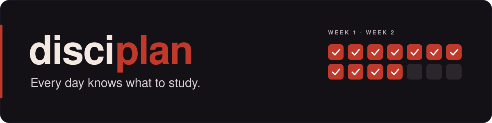</a>
</p>

<p align="center">
  <b>A study system for an exam period</b>: a daily plan, one study document per module, self-test trainers, and one build script that merges it all into a single offline page.<br>
  <sub>Plain Python 3 and vanilla HTML/CSS/JS. Runs from disk.</sub>
</p>

<p align="center">
  <a href="#use"></a>
  <a href="GUIDE.md#1--first-build"></a>
  <a href="#demo"></a>
</p>

<p align="center">
  <a href="#demo"></a>
  <a href="#how"></a>
  <a href="#get"></a>
  <a href="#use"></a>
  <a href="docs/MY-EXAM-PERIOD.md"></a>
</p>

<a name="demo"></a>
<p><a href="#demo"></a></p>

This repo ships three **fictional** demo modules with the same structure as real ones: a study document, a trainer, a day plan. Build them and open the result (`python build.py`, then `klausuren.html`). The real course material I used for my own exams is not in this repo.

<table>
  <tr>
    <td width="33%" align="center" valign="top">
      <a href="module/KAF/KAF.html"></a><br>
      <a href="module/KAF/KAF.html"></a>
      <a href="module/KAF/KAF-Trainer.html"></a>
    </td>
    <td width="33%" align="center" valign="top">
      <a href="module/RAD/RAD.html">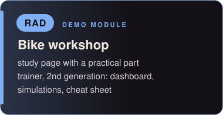</a><br>
      <a href="module/RAD/RAD.html"></a>
      <a href="module/RAD/RAD-Trainer.html"></a>
    </td>
    <td width="33%" align="center" valign="top">
      <a href="module/GAR/GAR.html">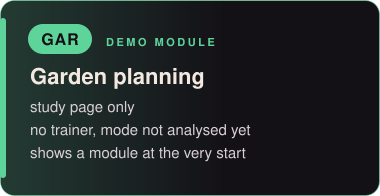</a><br>
      <a href="module/GAR/GAR.html"></a>
      <a href="GUIDE.md#3--replace-the-demo-with-your-modules"></a>
    </td>
  </tr>
</table>

Each module keeps its colour everywhere: here, in the cockpit and in its trainer.

---

<a name="how"></a>
<p><a href="#how">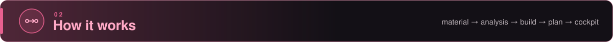</a></p>

<p align="center"><a href="GUIDE.md"></a></p>

**Material** goes into `module/<K>/` (old exams, slides). **Analyse** decides what the exam rewards and picks a mode per module (rules in [CLAUDE.md](CLAUDE.md)). **Build** writes the study document, the trainer and a `fehler-log.md` for mistakes. **Plan** is typed blocks with steps in `klausuren_data.py`. **Cockpit** is `python build.py`: one `klausuren.html` for everything.

---

<a name="get"></a>
<p><a href="#get">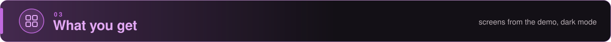</a></p>

All screens are from the demo modules, in dark mode.

<table>
  <tr>
    <td width="50%" align="center" valign="top"><a href="GUIDE.md#2--set-your-dates">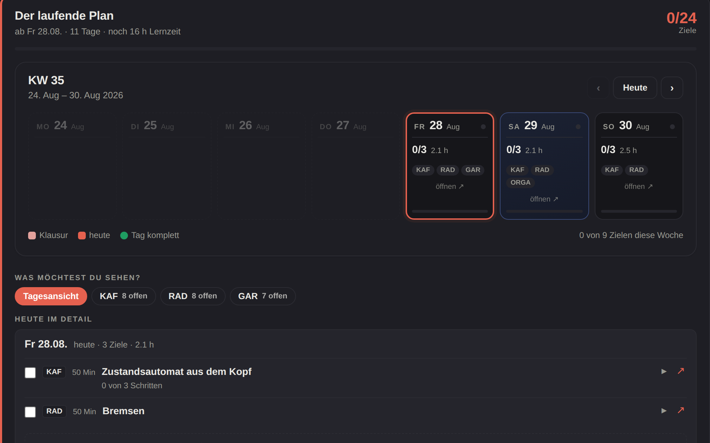</a><br><b>Day plan</b><br><sub>a week, typed blocks, one line for "enough"</sub></td>
    <td width="50%" align="center" valign="top"><a href="klausuren_data.py">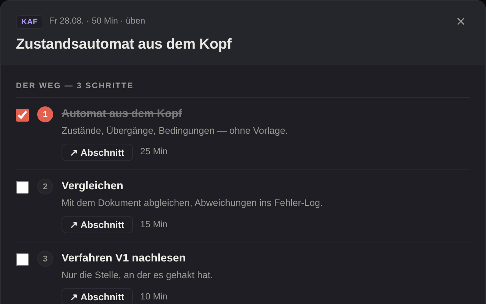</a><br><b>Block with steps</b><br><sub>checkable steps, each jumps into the study page</sub></td>
  </tr>
  <tr>
    <td width="50%" align="center" valign="top"><a href="module/KAF/KAF-Trainer.html">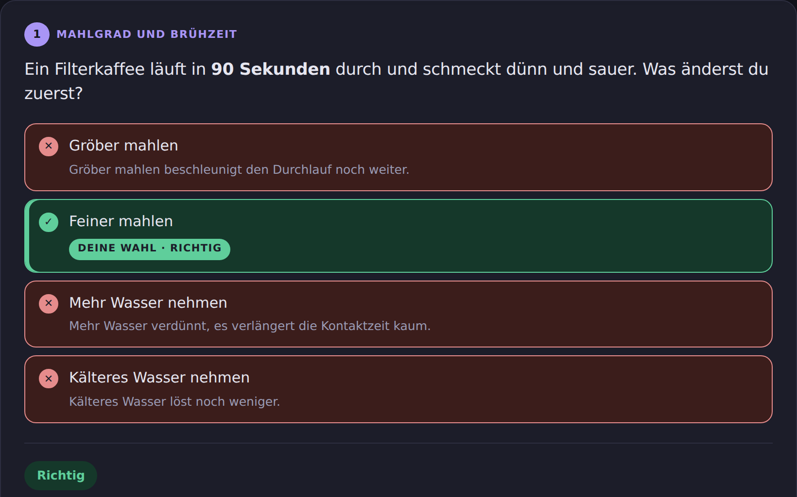</a><br><b>Trainer round</b><br><sub>every option gets a reason, not only the right one</sub></td>
    <td width="50%" align="center" valign="top"><a href="module/KAF/KAF.html">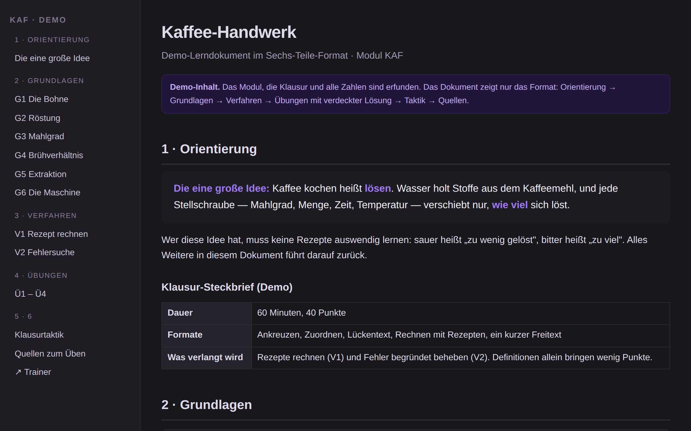</a><br><b>Study page</b><br><sub>six parts, from orientation to sources</sub></td>
  </tr>
</table>

Also: a countdown, a search across all modules (Ctrl K), a light/dark switch and print. Progress is saved in the browser.

---

<a name="use"></a>
<p><a href="#use">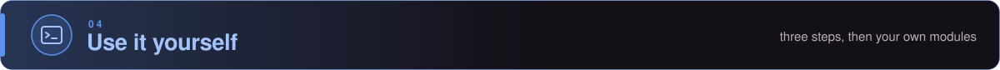</a></p>

1. **Build it.**
   ```bash
   python build.py
   ```
2. **Set your dates** in `PLAN` and `MODULES` in `klausuren_data.py`. `build.py` has none of its own.
3. **Add your modules** with the preset prompt [prompts/add-module.md](prompts/add-module.md). It analyses first and waits for your ok before it creates anything.

The full walkthrough, including what each date setting does, is in [GUIDE.md](GUIDE.md).

<table>
  <tr>
    <td>
      <a href="docs/MY-EXAM-PERIOD.md">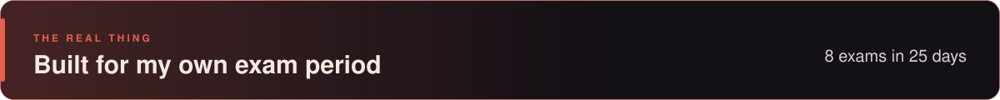</a><br>
      <a href="docs/MY-EXAM-PERIOD.md"></a>
    </td>
  </tr>
</table>

---

<a name="ai"></a>
<p><a href="#ai"></a></p>

I decided what the system should do, how each module is analysed and what goes into the study documents, and I tested all of it myself while studying for the exams. Claude (Anthropic) was my coding assistant: it helped write the code and the documents under my direction, following the rules in [CLAUDE.md](CLAUDE.md).
