<a name="top"></a>
<p align="center"><a href="#top">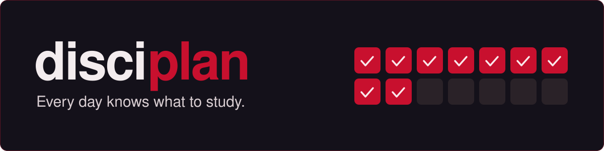</a></p>

<p align="center">
  <b>A daily plan, one study document per module and self-test trainers, merged into one offline page.</b><br>
  <sub>Three invented demo modules to try. The course files of my real exam period are not in this repo.</sub>
</p>

<p align="center">
  <a href="#use"></a>
  <a href="#use"></a>
  <a href="#demo"></a>
</p>

<p align="center">
  <a href="#demo"></a>
  <a href="#how"></a>
  <a href="#get"></a>
  <a href="#use"></a>
  <a href="#where"></a>
  <a href="docs/MY-EXAM-PERIOD.md"></a>
</p>

---

<a name="demo"></a>
<p><a href="#demo"></a></p>

Three invented modules. Open a study page or a trainer: they run from the file system, no server needed. <sub>(GitHub shows `.html` files as source. Clone or download the repo and open them in a browser.)</sub>

<table>
  <tr>
    <td width="33%" valign="top">
      <a href="module/KAF/KAF.html">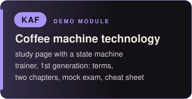</a><br>
      <a href="module/KAF/KAF.html"></a>
      <a href="module/KAF/KAF-Trainer.html"></a>
    </td>
    <td width="33%" valign="top">
      <a href="module/RAD/RAD.html"></a><br>
      <a href="module/RAD/RAD.html"></a>
      <a href="module/RAD/RAD-Trainer.html"></a>
    </td>
    <td width="33%" valign="top">
      <a href="module/GAR/GAR.html">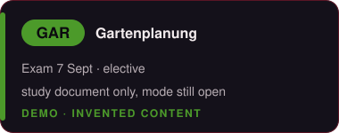</a><br>
      <a href="module/GAR/GAR.html"></a>
      <a href="GUIDE.md#trainers-are-optional">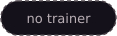</a>
    </td>
  </tr>
</table>

Or open the whole thing: after `python scripts/build.py`, `klausuren.html` is the cockpit with all three modules, the day plan and the trainer links.

---

<a name="how"></a>
<p><a href="#how"></a></p>

<p align="center"><a href="#use">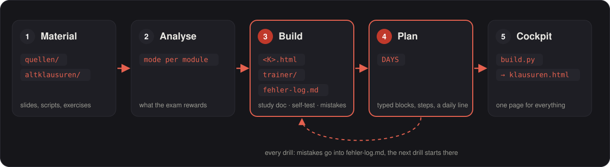</a></p>

1. **Material**: slides, scripts and old exams go into `module/<K>/quellen/` and `altklausuren/`.
2. **Analysis**: each module gets a mode (old-exam-driven, material-driven or mixed) from the files, not from a feeling.
3. **Build**: a study document, optionally a trainer, and an error log per module.
4. **Plan**: every day is a list of checkable steps, not hours.
5. **Cockpit**: `python scripts/build.py` merges it all into `klausuren.html`.

---

<a name="get"></a>
<p><a href="#get"></a></p>

Screenshots of the demo, dark mode. Each one opens the file it shows.

<table>
  <tr>
    <td width="33%" align="center" valign="top"><a href="klausuren.html">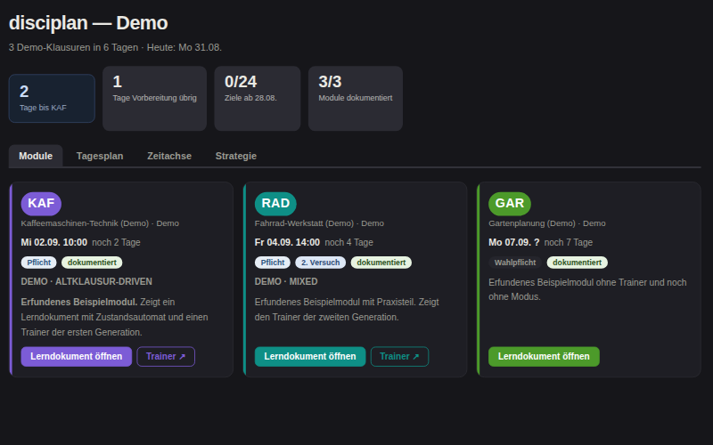</a><br><b>Cockpit</b><br><sub>one card per module</sub></td>
    <td width="33%" align="center" valign="top"><a href="klausuren.html">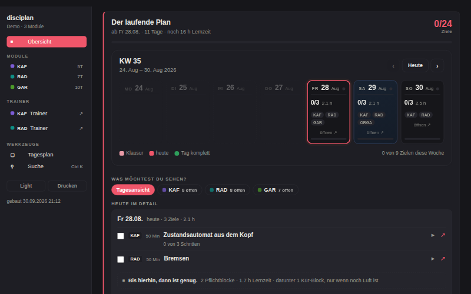</a><br><b>Day plan</b><br><sub>a week, and what today asks</sub></td>
    <td width="33%" align="center" valign="top"><a href="klausuren.html">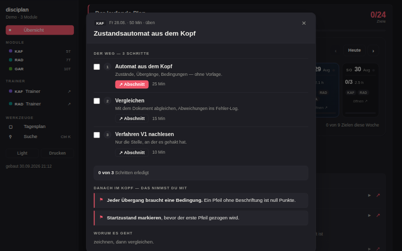</a><br><b>Steps</b><br><sub>a block as checkable states</sub></td>
  </tr>
  <tr>
    <td width="33%" align="center" valign="top"><a href="module/KAF/KAF.html">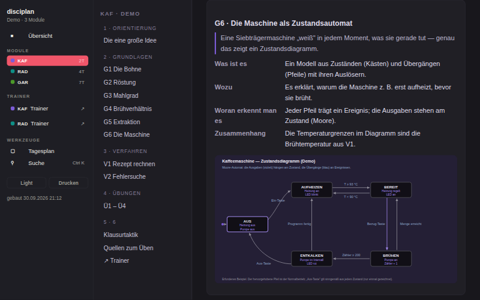</a><br><b>Study document</b><br><sub>from zero, picture first</sub></td>
    <td width="33%" align="center" valign="top"><a href="module/KAF/KAF-Trainer.html">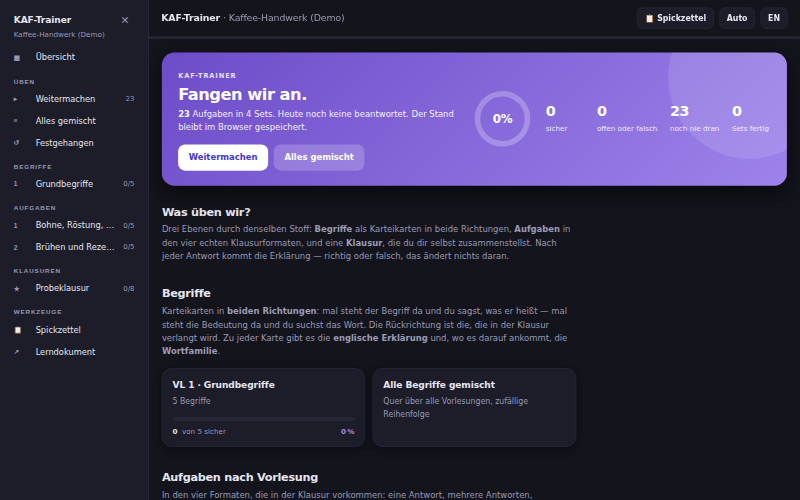</a><br><b>Trainer, first generation</b><br><sub>sets, cards, mock exam</sub></td>
    <td width="33%" align="center" valign="top"><a href="module/RAD/RAD-Trainer.html">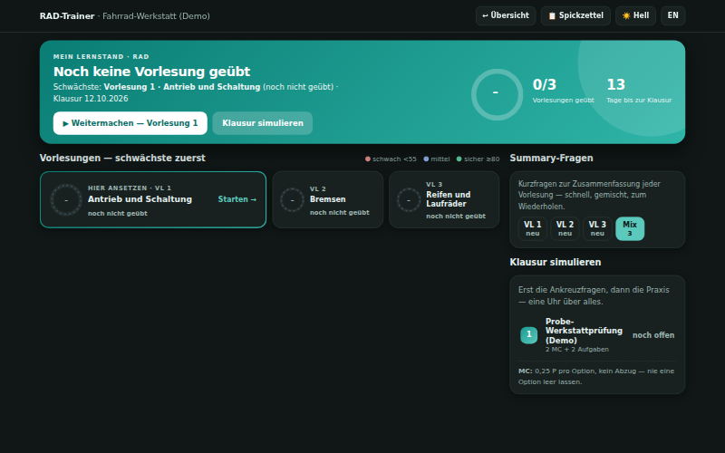</a><br><b>Trainer, second generation</b><br><sub>dashboard, simulations</sub></td>
  </tr>
</table>

Also in the cockpit: timeline, strategy tab, search across all modules (Ctrl K), light/dark switch, print. Trainer question types: single, multiple choice, numeric, text, ordering, matching, cloze, flashcards and generators with fresh numbers.

---

<a name="use"></a>
<p><a href="#use"></a></p>

**1. Build it.** Python 3, standard library only.

```bash
python scripts/build.py
```

**2. Put in your dates.** Exam dates, modules and the day plan are in [`klausuren_data.py`](klausuren_data.py). Build again.

**3. Add a module.** Put its old exams and slides into `module/<K>/`, then paste [`prompts/add-module.md`](prompts/add-module.md) into Claude Code. It analyses first and waits for your ok.

The details (every field, trainers, modes, the scripts) are in the [**GUIDE**](GUIDE.md).

---

<a name="where"></a>
<p><a href="#where"></a></p>

```
disciplan/
├── README.md, GUIDE.md   this page, and the details: open GUIDE to change dates or add a module
├── CLAUDE.md             rules for Claude sessions: open it before analysing a module
├── klausuren_data.py     modules, exam dates, day plan: open it to change dates or the plan
├── klausuren.html        the generated cockpit: open it in a browser, never edit it
├── scripts/              build, check, patch, restyle, theme, image tools: run from the repo root
├── assets/trainer/       shared trainer look (CSS, JS): open it to restyle every trainer
├── module/               KAF, RAD, GAR demo modules: open one to see how a module is built
├── prompts/              add-module.md: paste it into Claude Code to add a module
├── docs/                 my exam-period page, the README standard, all README images
└── examples/source/      my original README with real screenshots: a finished example, read only
```

---

<a name="exam-period"></a>
<p><a href="docs/MY-EXAM-PERIOD.md"></a></p>
<p align="center"><a href="docs/MY-EXAM-PERIOD.md"></a></p>

---

<a name="built"></a>
<p><a href="#built"></a></p>

I decided what the system should do and how a day in the plan should look, and I tested every part against my own exams. Claude, Anthropic's AI model, was the coding assistant: it wrote the code and the study documents I asked for.

It works under written rules in [`CLAUDE.md`](CLAUDE.md): analyse a module before building anything, propose the files and wait for my ok, and say so when my plan is worse than an alternative.
