[← Back to the README](../README.md)

<a href="#top">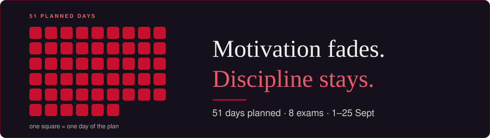</a>

This is my real exam period. The course files are not in this repo; the screenshots below show them.

---

<a href="#stopped">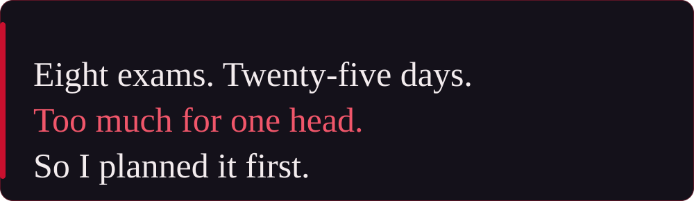</a>

---

Each study document is study material, not a reference book: nothing is assumed that isn't explained in it. Always the same six parts: **1 Orientierung** · **2 Grundlagen** (every term from zero, intuition before formalism, self-check questions) · **3 Verfahren** (procedures, each with *why* it works) · **4 Übungen** (solutions hidden in `
`) · **5 Klausurtaktik** · **6 Quellen zum Üben**. Pick a module:

 &nbsp;11 Grundlagen · 11 procedures · 46 fold-outs

 

<a href="#study-docs">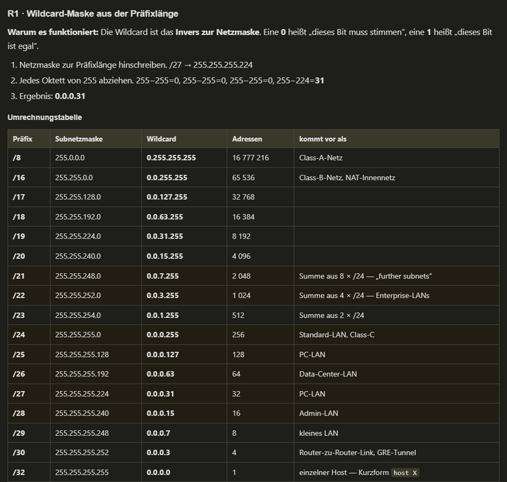</a> Procedure R1: the wildcard mask from the prefix length, why it works, and the full conversion table

 &nbsp;14 units · 70 SQL and code blocks · 66 tables

 

<a href="#study-docs">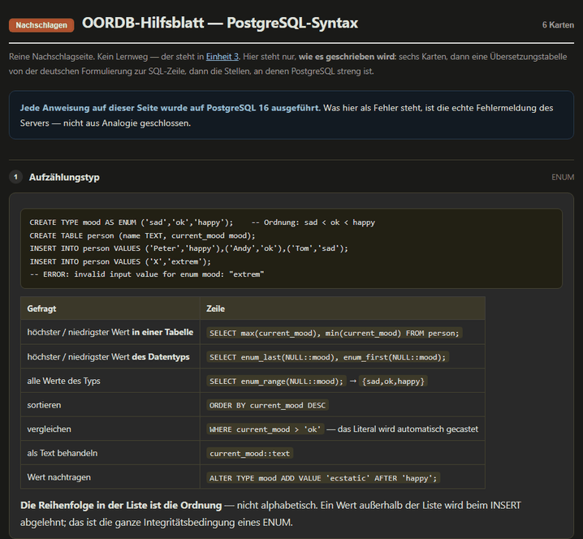</a> The OORDB syntax sheet: German wording → PostgreSQL line, every statement run on PostgreSQL 16

 &nbsp;7 learning units · 30 sketches in the document · 32 cards on the sketch sheet

 
<table>
  <tr>
    <td width="50%"><a href="#study-docs">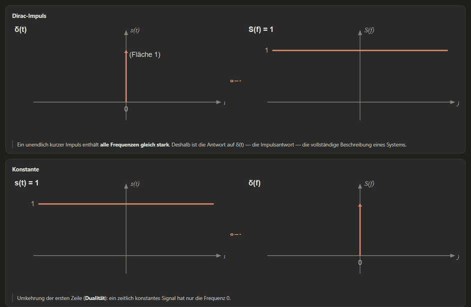</a></td>
    <td width="50%"></td>
  </tr>
  <tr>
    <td align="center">Every transform pair as a sketch: time domain ○—● frequency domain</td>
    <td align="center">The theorems drawn: time shift, modulation</td>
  </tr>
</table>

 &nbsp;12 Grundlagen · 23 code blocks · 8 fold-outs

 
<table>
  <tr>
    <td width="50%"></td>
    <td width="50%"><a href="#study-docs">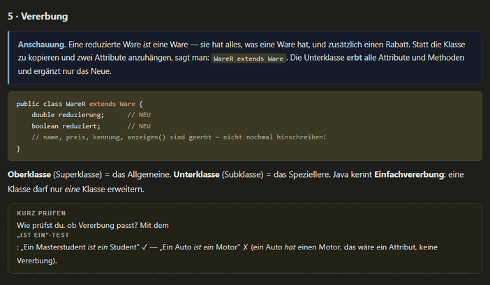</a></td>
  </tr>
  <tr>
    <td align="center">Grundlagen 1: picture first, then code, then what it means</td>
    <td align="center">Grundlagen 5: inheritance, code with a comment on every line</td>
  </tr>
</table>

 &nbsp;20 Grundlagen · 16 procedures · 50 fold-outs

 
<table>
  <tr>
    <td width="50%"><a href="#study-docs">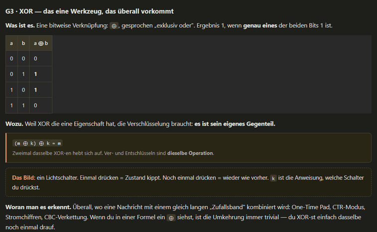</a></td>
    <td width="50%"><a href="#study-docs">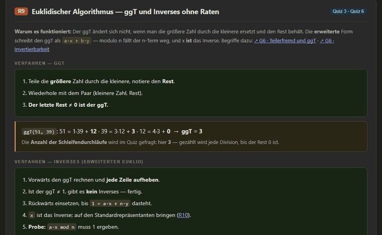</a></td>
  </tr>
  <tr>
    <td align="center">Grundlagen G3: XOR, what it is, why it matters, how to spot it</td>
    <td align="center">Procedure R9: Euclid and the inverse, fully worked</td>
  </tr>
</table>

 &nbsp;6 Grundlagen blocks · 45 tables

 
<table>
  <tr>
    <td width="50%"><a href="#study-docs">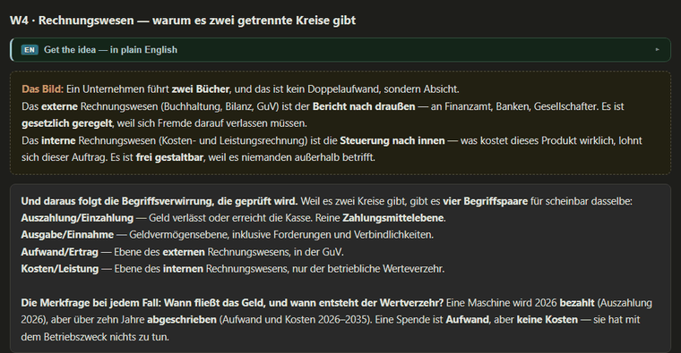</a></td>
    <td width="50%"></td>
  </tr>
  <tr>
    <td align="center">W4: why there are two accounting circles</td>
    <td align="center">W5: fixed vs. variable costs and the break-even</td>
  </tr>
</table>

 &nbsp;12 Grundlagen · 10 procedures · 15 diagrams · 30 fold-outs

 
<table>
  <tr>
    <td width="50%"></td>
    <td width="50%"><a href="#study-docs">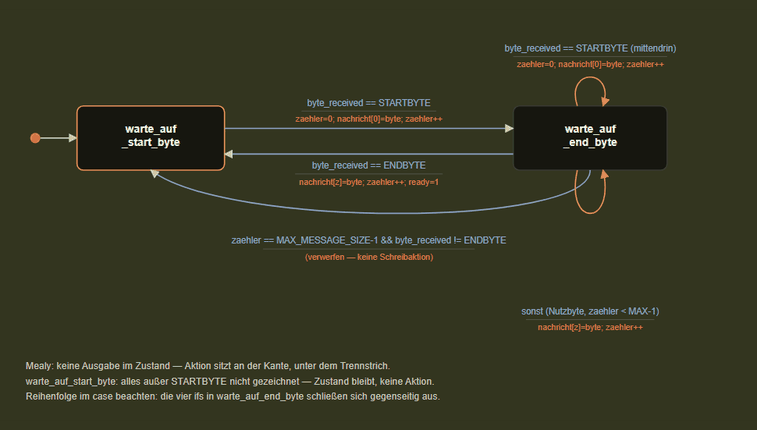</a></td>
  </tr>
  <tr>
    <td align="center">Grundlagen G8: state machines from zero</td>
    <td align="center">A chapter-E exercise drawn as a Mealy machine, full diagram</td>
  </tr>
</table>

 &nbsp;8 building blocks · 114 code blocks · 113 fold-outs

 
<table>
  <tr>
    <td width="50%"></td>
    <td width="50%"></td>
  </tr>
  <tr>
    <td align="center">B3 diagram: what Flask does between the socket and your function</td>
    <td align="center">B7 diagram: HTTP moves a message, RPC calls a function</td>
  </tr>
</table>

---

Five self-test apps, one per module that needed one. Each is a single HTML file. After answering, every option is judged with a reason, followed by an explanation, the source, and a link back into the study document. Pick one to see its main screen and a round:

 &nbsp;5 modes · 304 vocabulary cards · 104 lecture tasks · progress saved in the browser

 

<a href="#trainers">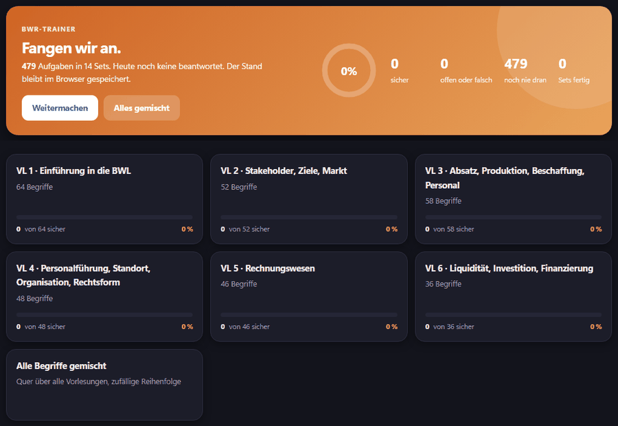</a>

**Shown: vocabulary cards.** A term or its definition from the lecture, typed from memory, in both directions. Then the model answer, an English gloss and, where it helps, the *Wortfamilie*. You rate yourself (*Hatte ich · Teilweise · Nicht gewusst*), and the weak ones come back.

 &nbsp;3 modes · 14 lecture quizzes · 255 questions, 39 with generators · progress saved in the browser

 

<a href="#trainers">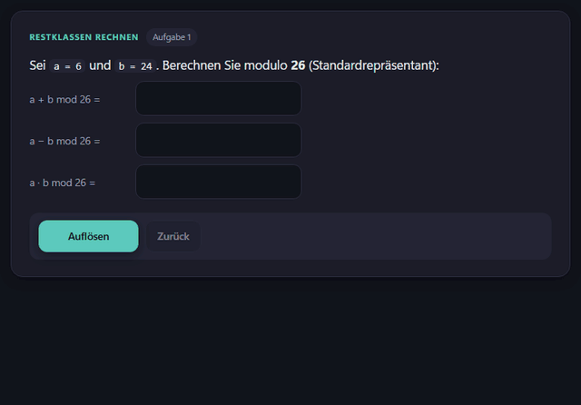</a>

**Shown: a lecture quiz, one question at a time.** Calculation questions are generators: after a correct answer, *„Mit neuen Zahlen üben“* builds the same question with fresh numbers, so you practise the procedure, not the answer. Quizzes also run as a sheet (5, 10 or all questions per page).

 &nbsp;6 modes · 88 chapter questions in 7 chapters · progress saved in the browser

 

<a href="#trainers">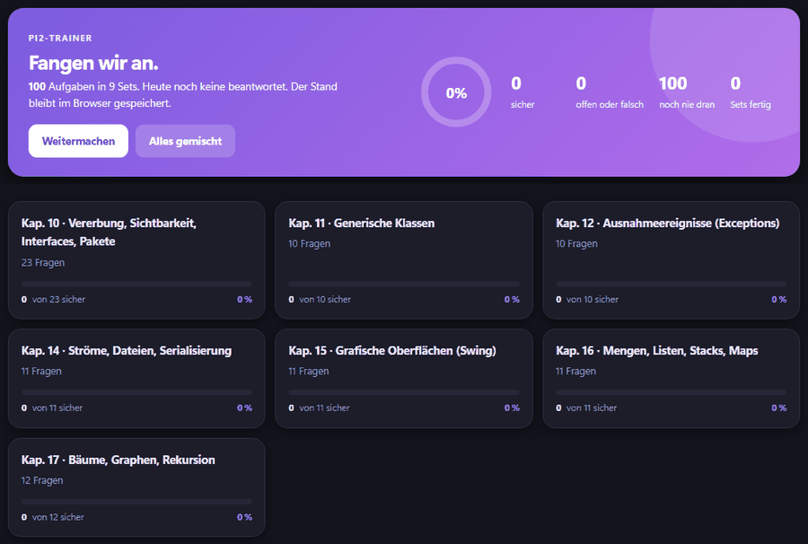</a>

**Shown: chapter questions, one at a time.** Each question comes from a script chapter (10–17). Wrong options explain *why* they are wrong, so a correct click still teaches the neighbouring cases.

 &nbsp;1 mode · 69 questions in 6 chapters · a primer per chapter

 

<a href="#trainers">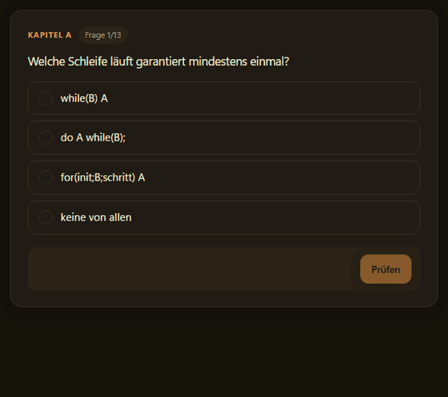</a>

**Shown: chapter A.** Every chapter opens with a *„Kurz erklärt“* primer (bit operators, nibbles, masks, shifts …), then the questions, with one sentence of feedback after each check.

 &nbsp;9 lectures · 501 lecture questions · 101 summary questions · progress saved in the browser

 

The main screen lists the nine lectures with their state, a summary-question mix per lecture, and practice rounds. Each lecture has its script and a question round. The ✓ on a question opens the correction next to it: every option with its reason and the slide it comes from. The ? shows how the same point could be asked differently.

All examples use lecture material only. No questions from real or old exams are shown.

---

<a href="#day-plan">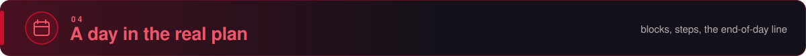</a>

<b>269 blocks on 51 days · 8 calendar weeks · 179 checkable steps</b>. The cockpit counts the 116 blocks from 28 August, when the plan was restarted.

<table>
  <tr>
    <td width="58%"><a href="#day-plan">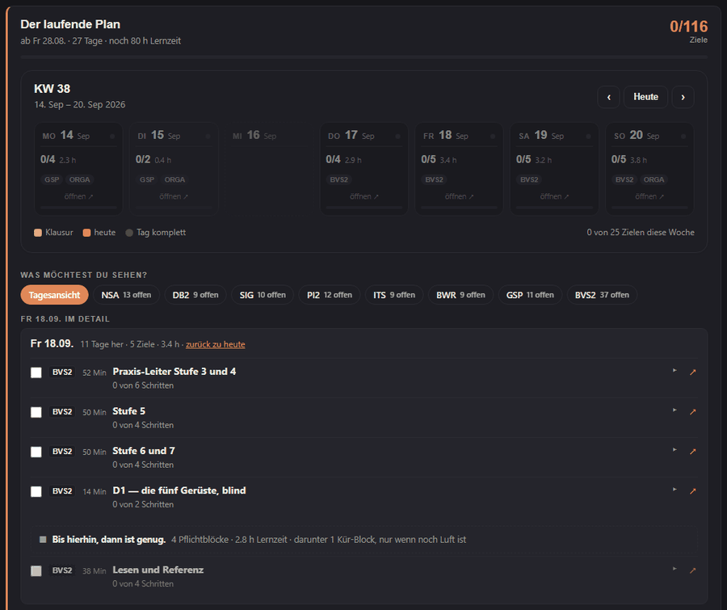</a></td>
    <td width="42%"></td>
  </tr>
  <tr>
    <td><b>The day</b>: blocks with module, minutes and type, the week above with its counters, one filter chip per module</td>
    <td><b>One block</b>: <i>„Der Weg“</i> as checkable steps, each with a jump into the study document (two steps ticked for the shot)</td>
  </tr>
</table>

---

<a href="#numbers">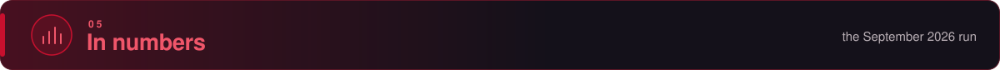</a>

<a href="#numbers">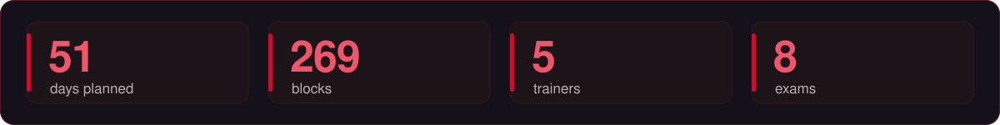</a>

