[← Back to the README](../README.md)

  <a href="../README.md">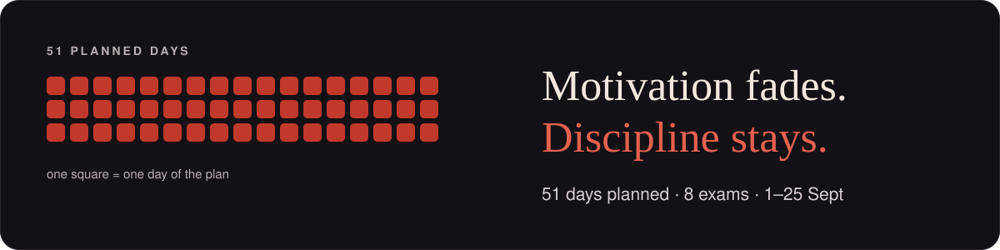</a>

This is my real exam period. The course files are not in this repo.

 open ▾

 

<a href="#story">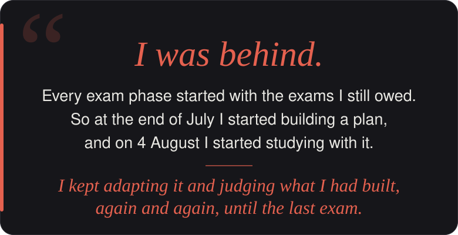</a>

Before this exam phase I was behind. I had pushed exams back in earlier semesters, and every new exam phase started with that weight: thinking about the ones I still owed. This time I was motivated, but I know motivation doesn't last. It's a feeling, and feelings fade. So I tried to turn it into something that stays: daily work, with a clear goal for each day.

For me the most important thing was organisation. Without it you lose a lot of time. You spend the first week reading one lecture, and then you try to do everything in the last three days. I've noticed that studying has two phases: the calm phase, and the phase where the exam date is close and the stress kicks in. That difference matters more than people think. Under stress, even easy topics start to feel hard. So I wanted a system that makes the calm phase count, where I always know what to do today, instead of deciding it again every morning.

What worked? Honestly, almost everything. For the module SIG, having all the sketches summarized in one place, and understanding the concepts through diagrams, made a huge difference. For BWR, the trainer was the best part. That module was hard for me because of the language: the vocabulary was completely new to me, words I had never used before. So it was mostly a memorizing problem, and practicing with the trainer solved it. For PI2, I wrote a lot of OOP examples and wrote the code skeleton again and again, many, many times. And for ITS, the trainer again was the best thing. I'll look back at everything later and judge it properly, but right now I'd say it all helped. With these exams, I'm happy with the results.

What didn't work so well was the time estimates. I built the plan together with an AI, and the time it gave each task was often off. That's something I want to handle better next time. I also think I prepared BVS2 the wrong way. I built everything around the exam and the lab tasks, and it didn't work out this time. But the subject really caught me. Now I get a second chance to actually master it, and this time I'm aiming for a 1.0.

Next time I'd keep the system, but change three things. First, practice becomes the main way to learn: exercises I create myself, starting from beginner level. Second, the plan gets rest days, and I have to force myself to take them. Third, I'd build the materials during the semester, while I'm still taking the module. Then, when the exams come, everything is already there like handouts, and I can study with a clear view.

That phase changed more than my grades. I saw what I can actually do when I show up every day, and it helped me mentally more than I expected. When it was over, I wasn't tired. I'm glad to have fewer exams hanging over me, but mostly I'm taking a way of working with me. For me this is a starting point, not an ending.

<a href="#modules">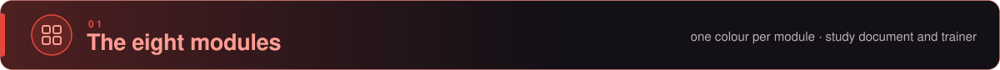</a>

 &nbsp;study doc: 11 Grundlagen · 11 procedures · 46 fold-outs

 

**Study document**

Procedure R1: the wildcard mask from the prefix length, why it works, and the full conversion table

 &nbsp;study doc: 14 units · 70 SQL and code blocks · 66 tables

 

**Study document**

The OORDB syntax sheet: German wording → PostgreSQL line, every statement run on PostgreSQL 16

 &nbsp;study doc: 7 learning units · 30 sketches in the document · 32 cards on the sketch sheet

 

**Study document**

 
Every transform pair as a sketch: time domain ○—● frequency domain

<a href="#mod-sig">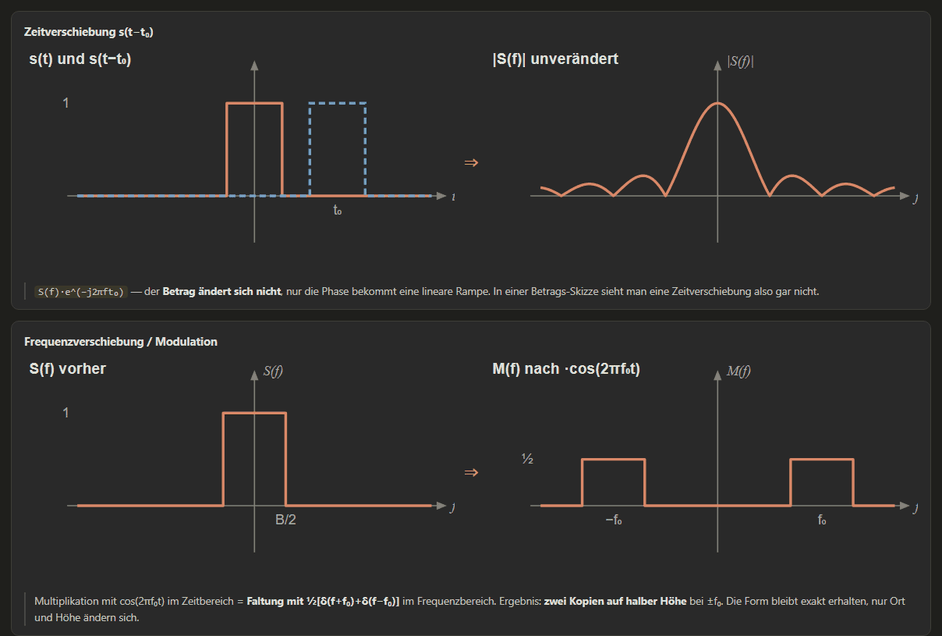</a> 
The theorems drawn: time shift, modulation

 &nbsp;study doc: 12 Grundlagen · 23 code blocks · 8 fold-outs &nbsp;·&nbsp; trainer: 6 modes · 88 chapter questions in 7 chapters · progress saved in the browser

 

**Study document**

<table>
  <tr>
    <td width="50%"><a href="#mod-pi2">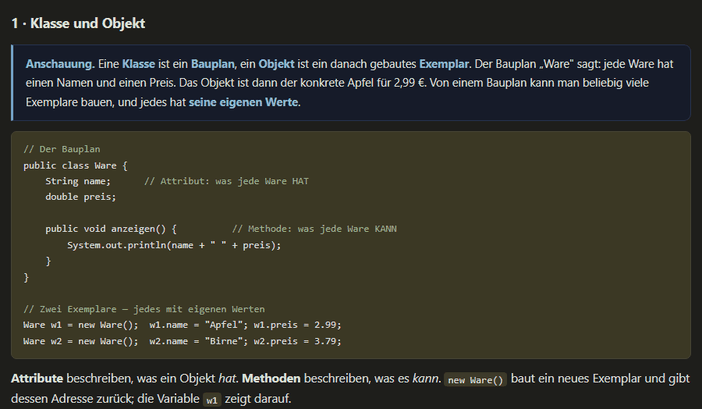</a></td>
    <td width="50%"></td>
  </tr>
  <tr>
    <td align="center">Grundlagen 1: picture first, then code, then what it means</td>
    <td align="center">Grundlagen 5: inheritance, code with a comment on every line</td>
  </tr>
</table>

<a href="#mod-pi2">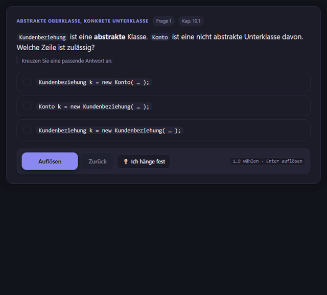</a>

**Shown: chapter questions, one at a time.** Each question comes from a script chapter (10–17). Wrong options explain *why* they are wrong, so a correct click still teaches the neighbouring cases.

 &nbsp;study doc: 20 Grundlagen · 16 procedures · 50 fold-outs &nbsp;·&nbsp; trainer: 3 modes · 14 lecture quizzes · 255 questions, 39 with generators · progress saved in the browser

 

**Study document**

<table>
  <tr>
    <td width="50%"></td>
    <td width="50%"></td>
  </tr>
  <tr>
    <td align="center">Grundlagen G3: XOR, what it is, why it matters, how to spot it</td>
    <td align="center">Procedure R9: Euclid and the inverse, fully worked</td>
  </tr>
</table>

<a href="#mod-its">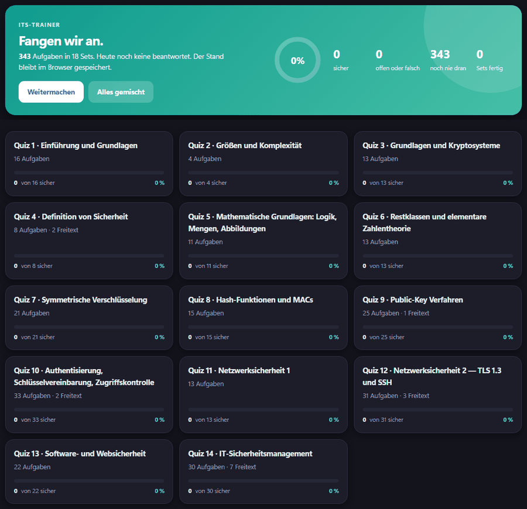</a>

**Shown: a lecture quiz, one question at a time.** Calculation questions are generators: after a correct answer, *„Mit neuen Zahlen üben“* builds the same question with fresh numbers, so you practise the procedure, not the answer. Quizzes also run as a sheet (5, 10 or all questions per page).

 &nbsp;study doc: 6 Grundlagen blocks · 45 tables &nbsp;·&nbsp; trainer: 5 modes · 304 vocabulary cards · 104 lecture tasks · progress saved in the browser

 

**Study document**

<table>
  <tr>
    <td width="50%"></td>
    <td width="50%"><a href="#mod-bwr">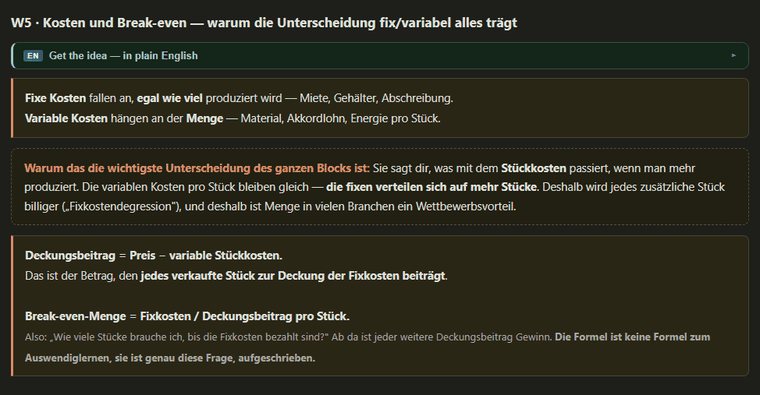</a></td>
  </tr>
  <tr>
    <td align="center">W4: why there are two accounting circles</td>
    <td align="center">W5: fixed vs. variable costs and the break-even</td>
  </tr>
</table>

<a href="#mod-bwr">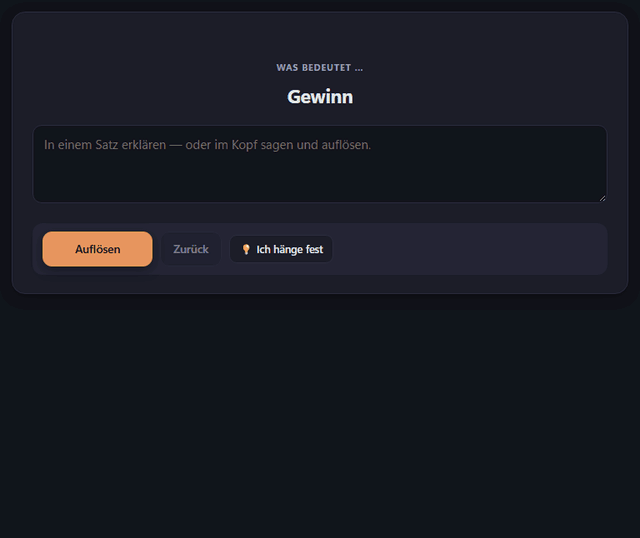</a>

**Shown: vocabulary cards.** A term or its definition from the lecture, typed from memory, in both directions. Then the model answer, an English gloss and, where it helps, the *Wortfamilie*. You rate yourself (*Hatte ich · Teilweise · Nicht gewusst*), and the weak ones come back.

 &nbsp;study doc: 12 Grundlagen · 10 procedures · 15 diagrams · 30 fold-outs &nbsp;·&nbsp; trainer: 1 mode · 69 questions in 6 chapters · a primer per chapter

 

**Study document**

<table>
  <tr>
    <td width="50%"><a href="#mod-gsp">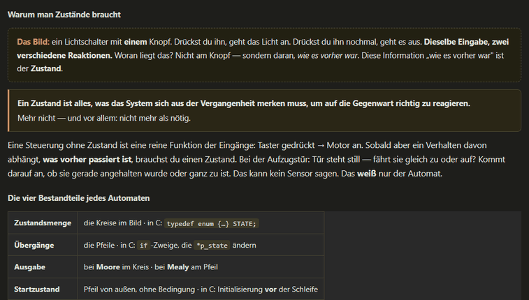</a></td>
    <td width="50%"></td>
  </tr>
  <tr>
    <td align="center">Grundlagen G8: state machines from zero</td>
    <td align="center">A chapter-E exercise drawn as a Mealy machine, full diagram</td>
  </tr>
</table>

<a href="#mod-gsp">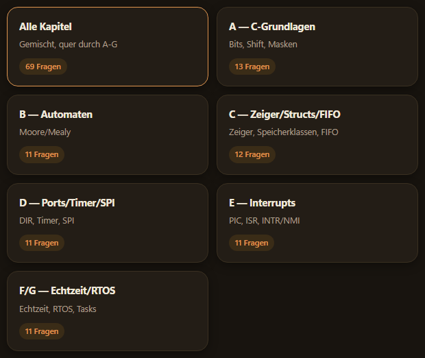</a>

**Shown: chapter A.** Every chapter opens with a *„Kurz erklärt“* primer (bit operators, nibbles, masks, shifts …), then the questions, with one sentence of feedback after each check.

 &nbsp;study doc: 8 building blocks · 114 code blocks · 113 fold-outs &nbsp;·&nbsp; trainer: 9 lectures · 501 lecture questions · 101 summary questions · progress saved in the browser

 

**Study document**

<table>
  <tr>
    <td width="50%"><a href="#mod-bvs2">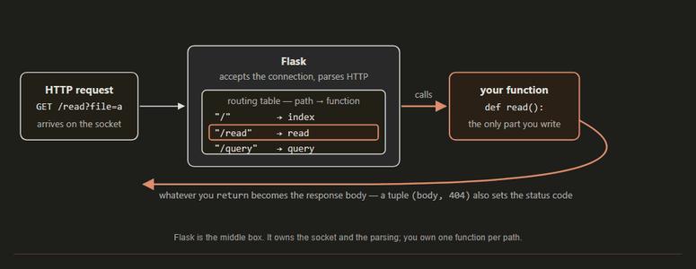</a></td>
    <td width="50%"><a href="#mod-bvs2">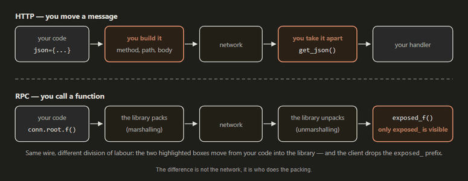</a></td>
  </tr>
  <tr>
    <td align="center">B3 diagram: what Flask does between the socket and your function</td>
    <td align="center">B7 diagram: HTTP moves a message, RPC calls a function</td>
  </tr>
</table>

<a href="#mod-bvs2">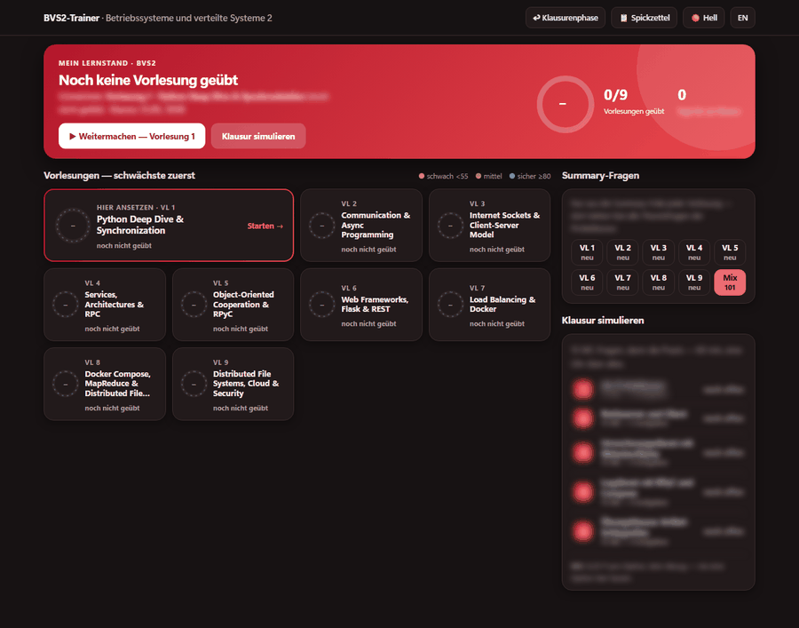</a>

<a href="#mod-bvs2">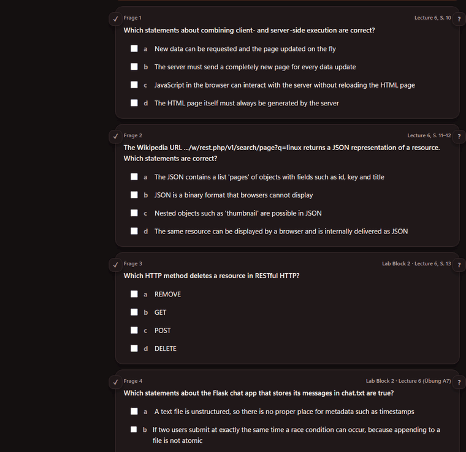</a>

The main screen lists the nine lectures with their state, a summary-question mix per lecture, and practice rounds. Each lecture has its script and a question round. The ✓ on a question opens the correction next to it: every option with its reason and the slide it comes from. The ? shows how the same point could be asked differently.

---

<a href="#plan">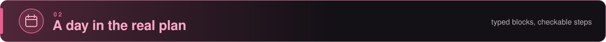</a>

<table>
  <tr>
    <td width="58%"></td>
    <td width="42%"><a href="#plan">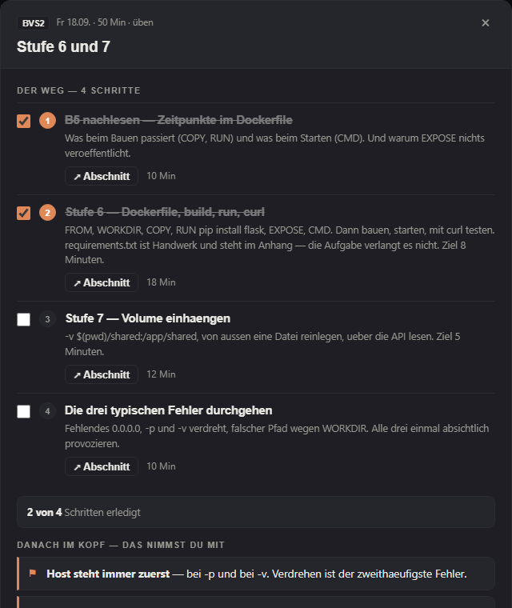</a></td>
  </tr>
  <tr>
    <td><b>The day</b>: blocks with module, minutes and type, the week above with its counters, one filter chip per module</td>
    <td><b>One block</b>: <i>„Der Weg“</i> as checkable steps, each with a jump into the study document (two steps ticked for the shot)</td>
  </tr>
</table>

---

<a href="#numbers">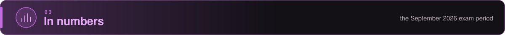</a>

<b>51 days · 269 blocks · 5 trainers · 8 exams</b>

