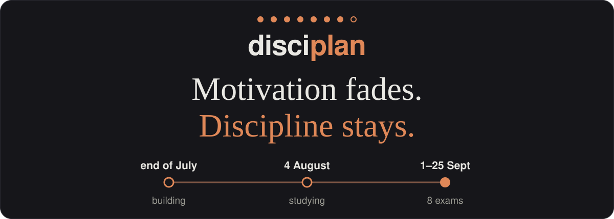
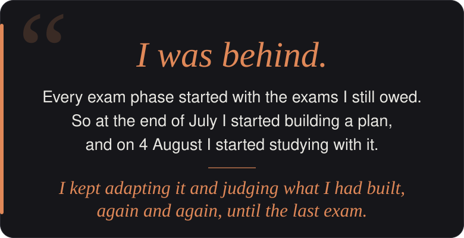
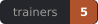
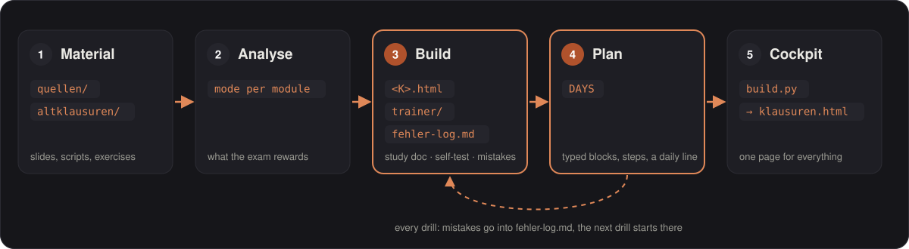
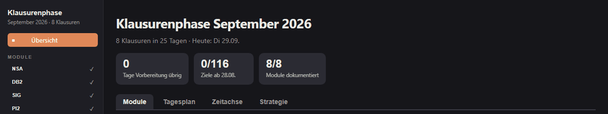
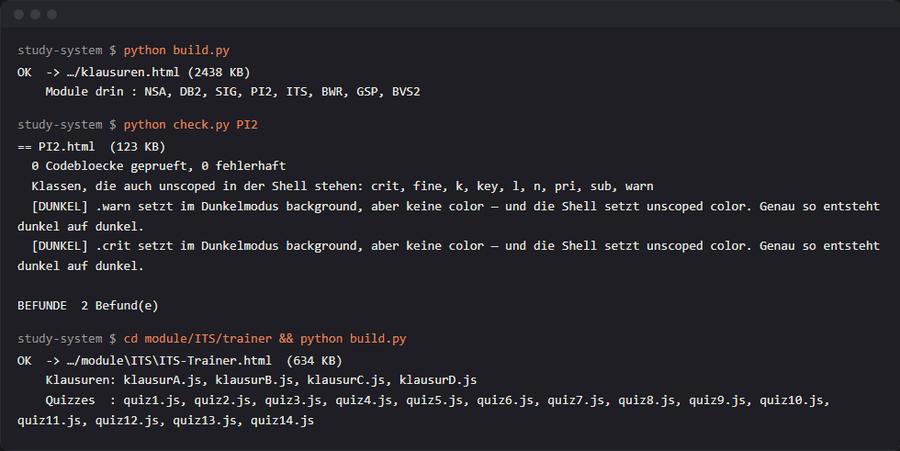

> **Private repository. Contains course material and must never be made public or shared with collaborators.**

<p align="center">
  
</p>

<p align="center">
  
</p>

<div align="center">
<details>
<summary></summary>
<br>
<div align="left">

Before this exam phase I was behind. I had pushed exams back in earlier semesters, and every new exam phase started with that weight: thinking about the ones I still owed. This time I was motivated, but I know motivation doesn't last. It's a feeling, and feelings fade. So I tried to turn it into something that stays: daily work, with a clear goal for each day.

For me the most important thing was organisation. Without it you lose a lot of time. You spend the first week reading one lecture, and then you try to do everything in the last three days. I've noticed that studying has two phases: the calm phase, and the phase where the exam date is close and the stress kicks in. That difference matters more than people think. Under stress, even easy topics start to feel hard. So I wanted a system that makes the calm phase count, where I always know what to do today, instead of deciding it again every morning.

What worked? Honestly, almost everything. For the module SIG, having all the sketches summarized in one place, and understanding the concepts through diagrams, made a huge difference. For BWR, the trainer was the best part. That module was hard for me because of the language: the vocabulary was completely new to me, words I had never used before. So it was mostly a memorizing problem, and practicing with the trainer solved it. For PI2, I wrote a lot of OOP examples and wrote the code skeleton again and again, many, many times. And for ITS, the trainer again was the best thing. I'll look back at everything later and judge it properly, but right now I'd say it all helped. With these exams, I'm happy with the results.

What didn't work so well was the time estimates. I built the plan together with an AI, and the time it gave each task was often off. That's something I want to handle better next time. I also think I prepared BVS2 the wrong way. I built everything around the exam and the lab tasks, and it didn't work out this time. But the subject really caught me. Now I get a second chance to actually master it, and this time I'm aiming for a 1.0.

Next time I'd keep the system, but change three things. First, practice becomes the main way to learn: exercises I create myself, starting from beginner level. Second, the plan gets rest days, and I have to force myself to take them. Third, I'd build the materials during the semester, while I'm still taking the module. Then, when the exams come, everything is already there like handouts, and I can study with a clear view.

That phase changed more than my grades. I saw what I can actually do when I show up every day, and it helped me mentally more than I expected. When it was over, I wasn't tired. I'm glad to have fewer exams hanging over me, but mostly I'm taking a way of working with me. For me this is a starting point, not an ending.

</div>
</details>
</div>

<p align="center">
  <b>My system for 8 exams in one exam period</b>: a daily plan, one study document per module, self-test trainers, and one build script that merges it all into a single page.<br>
  <sub>TH Köln · Bachelor Technische Informatik · 01.–25.09.2026</sub><br>
  <sub>Snapshot of the September 2026 exam period.</sub>
</p>

<p align="center">
  
  
  
  
</p>

<p align="center">
  <a href="#day-plan"></a>
  <a href="#trainers"></a>
  <a href="#study-docs"></a>
  <a href="#cockpit"></a>
  <a href="#sources"></a>
  <a href="#build"></a>
  <a href="#add-a-new-module"></a>
</p>

## How it works

<p align="center"></p>

<a name="day-plan"></a>
### A day in the plan

<sub><b>269 blocks on 51 days · 8 calendar weeks · 179 checkable steps</b> — the cockpit counts the 116 blocks from 28 August, when the plan was restarted.</sub>

<table>
  <tr>
    <td width="58%"></td>
    <td width="42%"></td>
  </tr>
  <tr>
    <td><sub><b>The day</b>: blocks with module, minutes and type, the week above with its counters, one filter chip per module</sub></td>
    <td><sub><b>One block</b>: <i>„Der Weg“</i> as checkable steps, each with a jump into the study document (two steps ticked for the shot)</sub></td>
  </tr>
</table>

Every block has a type: **L** lesen · **U** üben · **D** aus dem Kopf · **T** Test · **W** Wiederholung · **O** Orga · **V** Kür (optional). Under the required blocks sits the **end-of-day line**, *„Bis hierhin, dann ist genug“*, with the block count and study hours (the exam itself isn't counted). Kür blocks go below it, and once everything above is ticked it turns into *„Tagesziel erreicht“*. Tick every step in a block's panel and the block ticks itself; progress is saved in the browser.

## Trainers

Five self-test apps, one per module that needed one. Each is a single HTML file. After answering, every option is judged with a reason, followed by an explanation, the source, and a link back into the study document. **Pick one to see its main screen and a round:**

<details>
<summary> &nbsp;<sub>5 modes · 304 vocabulary cards · 104 lecture tasks · progress saved in the browser</sub></summary>
<br>
<p align="center"></p>
<p align="center"></p>

**Shown: vocabulary cards.** A term or its definition from the lecture, typed from memory, in both directions. Then the model answer, an English gloss and, where it helps, the *Wortfamilie*. You rate yourself (*Hatte ich · Teilweise · Nicht gewusst*), and the weak ones come back.
</details>

<details>
<summary> &nbsp;<sub>3 modes · 14 lecture quizzes · 255 questions, 39 with generators · progress saved in the browser</sub></summary>
<br>
<p align="center"></p>
<p align="center"></p>

**Shown: a lecture quiz, one question at a time.** Calculation questions are generators: after a correct answer, *„Mit neuen Zahlen üben“* builds the same question with fresh numbers, so you practise the procedure, not the answer. Quizzes also run as a sheet (5, 10 or all questions per page).
</details>

<details>
<summary> &nbsp;<sub>6 modes · 88 chapter questions in 7 chapters · progress saved in the browser</sub></summary>
<br>
<p align="center"></p>
<p align="center"></p>

**Shown: chapter questions, one at a time.** Each question comes from a script chapter (10–17). Wrong options explain *why* they are wrong, so a correct click still teaches the neighbouring cases.
</details>

<details>
<summary> &nbsp;<sub>1 mode · 69 questions in 6 chapters · a primer per chapter</sub></summary>
<br>
<p align="center"></p>
<p align="center"></p>

**Shown: chapter A.** Every chapter opens with a *„Kurz erklärt“* primer (bit operators, nibbles, masks, shifts …), then the questions, with one sentence of feedback after each check.
</details>

<details>
<summary> &nbsp;<sub>9 lectures · 501 lecture questions · 101 summary questions · progress saved in the browser</sub></summary>
<br>
<p align="center"></p>
<p align="center"></p>

The main screen lists the nine lectures with their state, a summary-question mix per lecture, and practice rounds. Each lecture has its script and a question round. The ✓ on a question opens the correction next to it: every option with its reason and the slide it comes from. The ? shows how the same point could be asked differently.
</details>

<sub>All examples use lecture material only. No questions from real or old exams are shown.</sub>

<a name="study-docs"></a>
## Study documents

Each `module/<K>/<K>.html` is study material, not a reference book: nothing is assumed that isn't explained in it. Always the same six parts: **1 Orientierung** · **2 Grundlagen** (every term from zero, intuition before formalism, self-check questions) · **3 Verfahren** (procedures, each with *why* it works) · **4 Übungen** (solutions hidden in `<details>`) · **5 Klausurtaktik** · **6 Quellen zum Üben**. **Pick a module:**

<details>
<summary> &nbsp;<sub>11 Grundlagen · 11 procedures · 46 fold-outs</sub></summary>
<br>
<p align="center"></p>
<p align="center"><sub>Procedure R1: the wildcard mask from the prefix length, why it works, and the full conversion table</sub></p>
</details>

<details>
<summary> &nbsp;<sub>14 units · 70 SQL and code blocks · 66 tables</sub></summary>
<br>
<p align="center"></p>
<p align="center"><sub>The OORDB syntax sheet: German wording → PostgreSQL line, every statement run on PostgreSQL 16</sub></p>
</details>

<details>
<summary> &nbsp;<sub>7 learning units · 30 sketches in the document · 32 cards on the sketch sheet</sub></summary>
<br>
<p align="center"><br>
<sub>Every transform pair as a sketch: time domain ○—● frequency domain</sub></p>
<p align="center"><br>
<sub>The theorems drawn: time shift, modulation</sub></p>
</details>

<details>
<summary> &nbsp;<sub>12 Grundlagen · 23 code blocks · 8 fold-outs</sub></summary>
<br>
<table>
  <tr>
    <td width="50%"></td>
    <td width="50%"></td>
  </tr>
  <tr>
    <td align="center"><sub>Grundlagen 1: picture first, then code, then what it means</sub></td>
    <td align="center"><sub>Grundlagen 5: inheritance, code with a comment on every line</sub></td>
  </tr>
</table>
</details>

<details>
<summary> &nbsp;<sub>20 Grundlagen · 16 procedures · 50 fold-outs</sub></summary>
<br>
<table>
  <tr>
    <td width="50%"></td>
    <td width="50%"></td>
  </tr>
  <tr>
    <td align="center"><sub>Grundlagen G3: XOR, what it is, why it matters, how to spot it</sub></td>
    <td align="center"><sub>Procedure R9: Euclid and the inverse, fully worked</sub></td>
  </tr>
</table>
</details>

<details>
<summary> &nbsp;<sub>6 Grundlagen blocks · 45 tables</sub></summary>
<br>
<table>
  <tr>
    <td width="50%"></td>
    <td width="50%"></td>
  </tr>
  <tr>
    <td align="center"><sub>W4: why there are two accounting circles</sub></td>
    <td align="center"><sub>W5: fixed vs. variable costs and the break-even</sub></td>
  </tr>
</table>
</details>

<details>
<summary> &nbsp;<sub>12 Grundlagen · 10 procedures · 15 diagrams · 30 fold-outs</sub></summary>
<br>
<table>
  <tr>
    <td width="50%"></td>
    <td width="50%"></td>
  </tr>
  <tr>
    <td align="center"><sub>Grundlagen G8: state machines from zero</sub></td>
    <td align="center"><sub>A chapter-E exercise drawn as a Mealy machine, full diagram</sub></td>
  </tr>
</table>
</details>

<details>
<summary> &nbsp;<sub>8 building blocks · 114 code blocks · 113 fold-outs</sub></summary>
<br>
<table>
  <tr>
    <td width="50%"></td>
    <td width="50%"></td>
  </tr>
  <tr>
    <td align="center"><sub>B3 diagram: what Flask does between the socket and your function</sub></td>
    <td align="center"><sub>B7 diagram: HTTP moves a message, RPC calls a function</sub></td>
  </tr>
</table>
</details>

## More

<a name="cockpit"></a>
<details>
<summary><b>Cockpit</b> · one generated page for the whole exam period</summary>
<br>

`klausuren.html` is generated from the eight study documents and opens from disk, no server needed. Each module card shows date and time, Pflicht/Wahlpflicht, the attempt, the mode with its reasoning, and a link to the study document. The tabs are **Module**, **Tagesplan**, **Zeitachse** and **Strategie**. The sidebar links every module and trainer, and has a search across all modules (Ctrl K), a light/dark switch and print.


</details>

<a name="sources"></a>
<details>
<summary><b>Source hierarchy</b> · every module gets a mode before any material is built</summary>
<br>

A module's mode stays *unresolved* until its old exams are analysed (question types across years, drift in the newest exam, points, lecture coverage), and with fewer than three years of exams there is no guess. **ALTKLAUSUR-DRIVEN**: the old exams and their corrections *are* the material and `quellen/` only closes gaps · **STOFF-DRIVEN**: built from the learning objectives plus whatever exams exist · **MIXED**: a recurring core plus new questions, with the split named. The order of trust is **official solutions → old exams and their corrections → lecture material → own notes**. Each module README says which source wins where they disagree.
</details>

<a name="build-tooling"></a>
<details>
<summary><b>Build tooling</b> · stdlib Python, no dependencies</summary>
<br>

**`build.py`** reads `module/<K>/<K>.html` for every module in `klausuren_data.MODULES`, scopes each module's CSS to `#m-<K>`, namespaces its IDs, rewrites links between modules and to trainers, and writes one `klausuren.html` (~2.4 MB). **`klausuren_data.py`** holds the module metadata, the day plan (`DAYS`) and the overview texts; **`check.py`** lints code blocks, dead anchors and dark-mode clashes, with `<K>` for one module and `--plan` to check the day plan against the built cockpit. Each trainer has its own `trainer/build.py`, and `patch.py`, `restyle.py` and `theme.py` rewrite HTML in place. It all needs only Python 3 (last run with 3.14) and its standard library: no server, no framework, nothing to install.


</details>

<details>
<summary><b>Repository layout</b> · where everything lives</summary>
<br>

```
study-system/
├── klausuren.html          ← the cockpit (generated by build.py, do not edit by hand)
├── build.py                ← merges all module study documents into klausuren.html
├── klausuren_data.py       ← data for the cockpit: MODULES, DAYS (day plan), TEXT
├── check.py                ← text-based lint for the study documents and the day plan
├── patch.py / restyle.py / theme.py      ← maintenance tools (rewrite HTML in place)
├── trainer-style.css, trainer-*.js       ← shared trainer look and behaviour
├── CLAUDE.md               ← the rulebook: analysis modes, document structure, drill mode
├── prompts/add-module.md   ← preset prompt for adding a module
├── outputs/prompts/        ← a few saved working prompts
├── docs/readme/            ← every README image, one clear name each (replace freely)
└── module/
    ├── BVS2/  BWR/  DB2/  GSP/  ITS/  NSA/  PI2/  SIG/
```

| Module | Name | Exam style (as analysed) | Trainer |
|---|---|---|---|
| NSA | Netzsicherheit und Automation | Open book | — |
| DB2 | Datenbanken II | Altklausur- and exercise-driven | — |
| SIG | Signalverarbeitung | Altklausur-driven | — |
| PI2 | Praktische Informatik 2 | Altklausur-driven | ✓ |
| ITS | IT-Sicherheit | analysed, quiz-heavy | ✓ |
| BWR | Betriebswirtschaft und Recht | Stoff-driven (no old exams) | ✓ |
| GSP | Grundlagen der Systemprogrammierung | fixed format, changing scenario | ✓ |
| BVS2 | Betriebssysteme & Verteilte Systeme 2 | practical (Flask, Docker, RPC) | ✓ |

Every module folder follows the same pattern:

| Item | What it is |
|---|---|
| `README.md` | The module's operating manual, readable in 30 seconds: exam date, mode and why, what's in the folder, how to work with it, the expensive traps, what's still open |
| `<K>.html` | The study document |
| `fehler-log.md` | Every mistake from drill sessions, appended as it happens. Drills start from here |
| up to two more `.md` | Module-specific artefacts, only when the analysis justified them (e.g. `ss20-loesung.md`, `verfahren.md`, `quizzes.md`) |
| `<K>-Trainer.html` + `trainer/` | Self-test app: `shell.html` (the app), `data/` (question banks), `gen2.js` (generators, BWR/ITS/PI2), `build.py` (injects the data). GSP's trainer is a single hand-written file. `restyle.py` injects the shared `trainer-style.css` and `trainer-*.js` into every `shell.html` |
| `altklausuren/` | Old exams, mock exams, quizzes, official solutions |
| `quellen/` | Lecture slides and scripts |
</details>

## Add a new module

Put the old exams in `module/<K>/altklausuren/` and the lecture material in `module/<K>/quellen/`. Then paste this into Claude Code in the repo root. **The green lines are the ones you change**: fill in the `<…>` fields there, everything else stays as it is. Claude analyses first, proposes the mode, and waits for your ok before creating anything.

```diff
 Add a new module to the study system.
+ Module: <KÜRZEL> — <full module name>
+ Exam:   <YYYY-MM-DD>, <HH:MM>
+ The material is in module/<KÜRZEL>/altklausuren/ and module/<KÜRZEL>/quellen/.

 1. Read CLAUDE.md completely. As the reference, read module/PI2/README.md, the <head> and
    sidebar of module/PI2/PI2.html, and the PI2 entry in MODULES in klausuren_data.py.
 2. Analyse as CLAUDE.md → MODULE ANALYSIS (a–e) says, from the files, not impressions:
    question types across years, drift in the newest exam, share of the lecture the exams
    touch, points per question type. Fewer than three years: the mode stays UNRESOLVED.
 3. Propose, then STOP: the mode with confidence and the evidence that would flip it; the
    artefacts (max. three .md incl. fehler-log.md: name, content, why this module, how it
    is drilled); whether a trainer is worth it; and ask me for examiner, attempt and
    Pflicht/Wahlpflicht. Create no files before my ok.
 4. After my ok, build:
    - module/<K>/README.md (the six sections from CLAUDE.md), fehler-log.md, the artefacts
    - module/<K>/<K>.html in the six parts (LERNDOKUMENT — Aufbau), reusing the <head>,
      CSS and sidebar of PI2.html so build.py picks it up unchanged
    - a MODULES entry in klausuren_data.py (k, name, d, t, v, typ, prof, mode, desc;
      trainer=dict(...) only with a trainer), in exam-date order; DAYS only if I ask
    - trainer, only if confirmed: copy module/PI2/trainer/, replace data/, set OUT and the
      file lists in its build.py, replace every PI2-specific text in shell.html (title,
      header, href="PI2.html#…"), run restyle.py on shell.html, then the trainer's build.py
 5. Run python build.py and python check.py <K>. Fix the findings for the new module and
    report the files created, the build output, and what is still open.
 Rules: German Fachsprache in module files. At most three .md per module plus README.md.
 No dates in file names. Don't touch other modules.
```

The same prompt as a file: [prompts/add-module.md](prompts/add-module.md).

<details>
<summary><b>Manual reference</b> · the same steps by hand</summary>
<br>

Say the new module is `MATH`.

1. **Create the folder** `module/MATH/` with `altklausuren/` and `quellen/`, and fill them.
2. **Write `module/MATH/README.md`** using the six-part structure (header, mode, what's here, how to work, what to know, open). Set the mode to "NOCH NICHT ANALYSIERT" for now.
3. **Analyse** the old exams as described in `CLAUDE.md` → *MODULE ANALYSIS*, pick the mode, decide the artefacts (at most three `.md` files, one of them `fehler-log.md`), and update the README.
4. **Write the study document** `module/MATH/MATH.html` in the six-part structure. Copy the `<head>`/CSS skeleton from an existing module so the sidebar and styles match.
5. **Register it in `klausuren_data.py`**: add a `dict(k="MATH", name=..., d="YYYY-MM-DD", t="HH:MM", v=1, typ="PF"|"WP", prof=..., mode=..., desc=...)` to `MODULES`. Add `trainer=dict(file="module/MATH/MATH-Trainer.html", was="...")` if it has one. Day-plan entries go into `DAYS` as `("MATH", minutes, type, "html text", "anchor")`, where type is `L` lesen · `U` üben · `D` aus dem Kopf · `T` Test · `W` Wiederholung · `O` Orga · `V` Kür. *A module folder that isn't in `MODULES` is ignored by `build.py`.*
6. **Optional trainer**: copy `module/PI2/trainer/` to `module/MATH/trainer/`, replace `data/`, fix the output name and file lists in `build.py`, replace the PI2-specific text in `shell.html`, run `python restyle.py module/MATH/trainer/shell.html`, then build it.
7. `python build.py`, then `python check.py MATH`.
</details>

## Build

```bash
python build.py                      # → klausuren.html
python module/PI2/trainer/build.py   # rebuild one trainer
python check.py                      # optional lint
```
